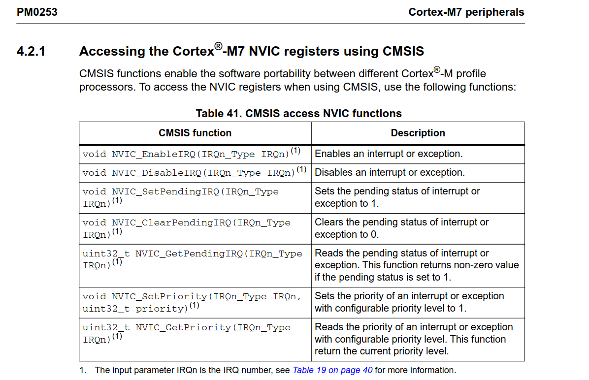
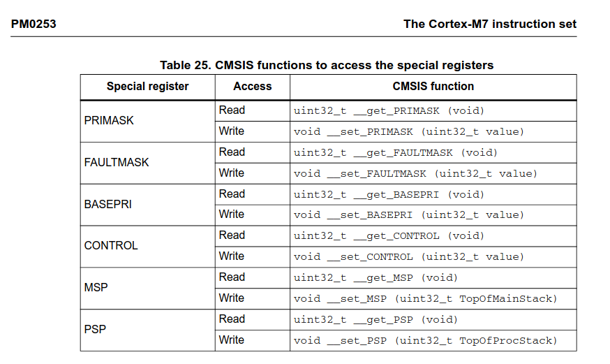

# Lab 3. Exceptions and interruptions

- *Найдите в разделе 4.2 документа PM0253 функции драйвера CMSIS, предназначенные для работы
с приоритетами и запишите в конспект их сигнатуру и назначение.*

- *Определите и запишите в конспект какие исключения не могут быть замаскированы через PRIMASK.
Найдите в разделе 3.2 документа PM0253 функции драйвера CMSIS, предназначенные для работы с
регистрами PRIMASK, BASEPRI и FAULTMASK и запишите в конспект их сигнатуру и назначение.*

- *Изучите разделы 2.3 и 2.4 документа RM0399, определите и запишите в конспект какие блоки SRAM
и FLASH памяти доступны в МК STM32H745, их размеры и адреса.*
