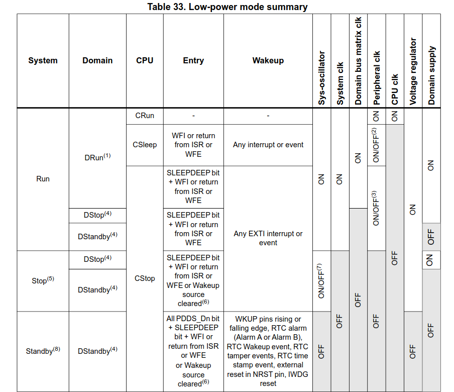
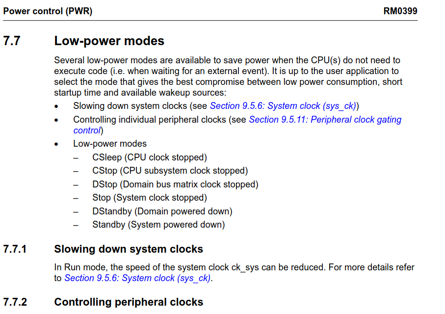

# Lab 4 - LL, SysTick, SW Timers, Cooperative planners

## Q&A

### Изучите режимы энергопотребления процессорного ядра Cortex-M7 [5]. А также режимы сна микроконтроллера (раздел 7. RM0399)

#### Operating modes

* CPU subsystem modes
    * CRun  
    CPU and CPU subsystem peripheral allocated via RCC PERxEN bits are clocked.
    * CSleep:  
    The CPU clocks is stalled and the CPU subsystem allocated peripheral(s) clock
    operate according to RCC PERxLPEN.
    * CStop:  
    CPU and CPU subsystem peripheral clocks are stalled.
    * DRun  
        he domain bus matrix is clocked:
        * The domain CPU subsystem (a) is in CRun or CSleep mode,
        or
        * the other domain CPU subsystem (a) having an allocated peripheral in the domain
        is in CRun or CSleep mode.
    * DStop  
    The domain bus matrix clock is stalled:
      - The domain CPU subsystem is in CStop mode
      and
      - The other domain CPU subsystem has no peripheral allocated in the domain.
      or the other domain CPU subsystem having an allocated peripheral in the domain
      is also in CStop mode
      and
      - At least one PDDS_Dn (b) bit for the domain select DStop.
    * DStandby
    The domain is powered down:
      - The domain CPU subsystem is in CStop mode
      and
      - The other domain CPU subsystem has no peripheral allocated in the domain
      or the other domain CPU subsystem having an allocated peripheral in the domain
      is also in CStop mode
      and
      - All PDDS_Dn(b) bits for the domain select DStandby mode.
* System /D3 domain modes
  * Run/Run\*  
    The system clock and D3 domain bus matrix clock are running:
    - A CPU subsystem is in CRun or CSleep mode
    or
    - A wakeup signal is active. (i.e. System D3 autonomous mode)
The Run\* mode is entered after a POR reset and a wakeup from Standby. In Run\*
mode, the performance is limited and the system supply configuration shall be
programmed in PWR control register 3 (PWR_CR3). The system enters Run
mode only when the ACTVOSRDY bit in PWR control status register 1
(PWR_CSR1) is set to 1
  * Stop  
  The system clock and D3 domain bus matrix clock is stalled:
    - both CPU subsystems are in CStop mode.
    and
    - all wakeup signals are inactive.
    and
    - At least one PDDS_Dn (b) bit for any domain select Stop mode

  * Standby
  The system is powered down:
    - both CPU subsystems are in CStop mode
    and
    - all wakeup signals are inactive.

